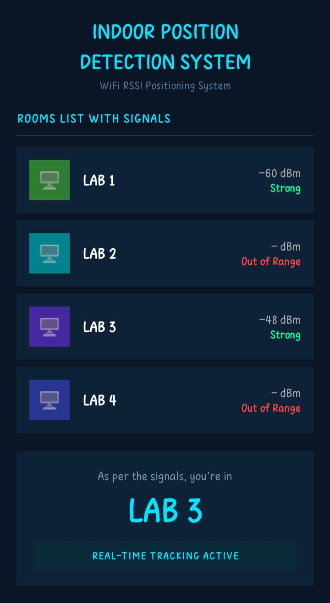
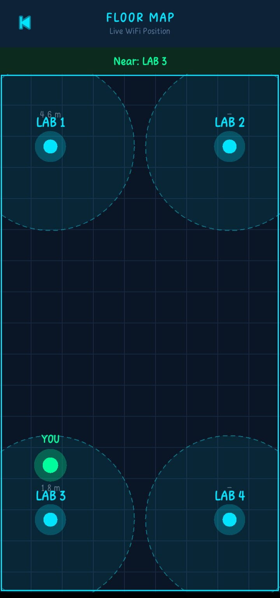
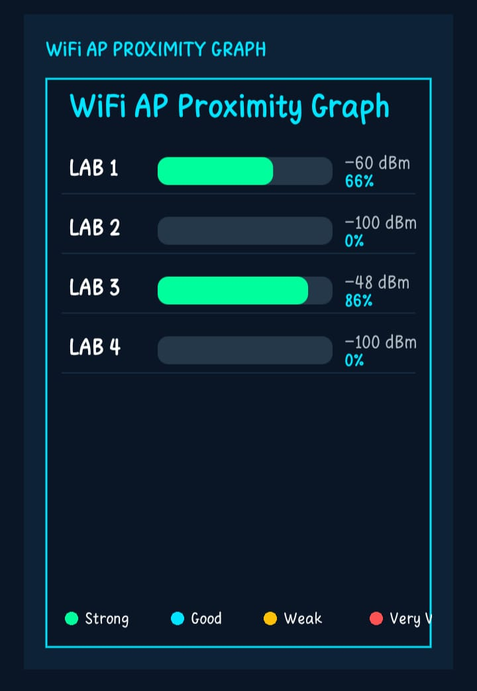
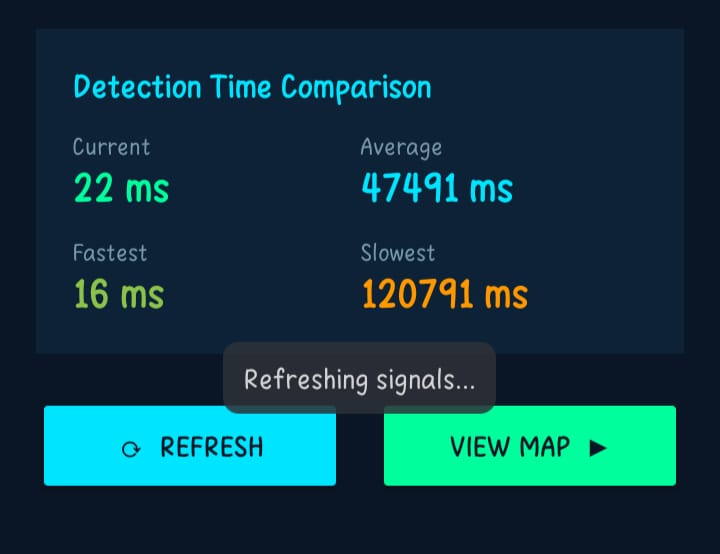

# 📡 Indoor Position Detection System

An Android application that detects your real-time indoor position using WiFi RSSI (Received Signal Strength Indicator) signals from access points placed in different lab rooms. No GPS required — works entirely indoors.

---

## 📱 Screenshots

| Signal Dashboard | Floor Map | Proximity Graph | Detection Time Comparison | 
|:---:|:---:|:---:|:---:|
|  |  |  |  |

---


## 🧠 How It Works

The app scans nearby WiFi access points and reads their RSSI values. Each lab room has a dedicated router with a known MAC address (BSSID). By comparing signal strengths across all 4 routers, the app estimates which room you are in and where exactly inside that room.

**Position estimation logic:**
- The router with the **strongest signal** = Primary (you are in this lab)
- The router with the **2nd strongest signal** = Secondary (direction you are leaning toward)
- Your position dot is placed **inside the primary lab's zone**, offset toward the secondary lab, at a distance proportional to the actual measured distance from the primary router

---

## 🗂️ Project Structure

```
app/
└── src/
    └── main/
        ├── java/com/example/indoorpositiondetectionsystem/
        │   ├── MainActivity.kt        # Signal dashboard, permission handling, auto-refresh, detection timing
        │   ├── MapActivity.kt         # Floor map screen with live scanning
        │   ├── MapView.kt             # Custom View — draws routers, coverage zones, YOU dot
        │   └── SignalGraphView.kt     # Custom View — horizontal RSSI bar graph with legend
        └── res/
            └── layout/
                ├── activity_main.xml  # Signal list UI with graph and timing stats
                └── activity_map.xml   # Map UI
```

---

## 🚀 Features

- **Live WiFi scanning** — auto-refreshes every 25 seconds, manual refresh available
- **Signal quality labels** — Strong / Good / Weak / Very Weak / Out of Range with color coding
- **Two-page UI** — Signal dashboard and interactive floor map
- **Smart position dot** — placed inside primary lab zone, leaning toward secondary lab
- **Overlap-safe labels** — router names and YOU label never overlap each other
- **No GPS or internet** needed — fully offline, WiFi only

---

## 🏗️ Tech Stack

| Layer | Technology |
|---|---|
| Language | Kotlin |
| Min SDK | Android 8.0 (API 26) |
| UI | XML Layouts + Custom Canvas View |
| Positioning | WiFi RSSI + Path-Loss Distance Model |
| Scanning | `WifiManager.startScan()` + `BroadcastReceiver` |

---

## 📶 Signal Quality Reference

| RSSI Range | Label | Color |
|---|---|---|
| ≥ -60 dBm | Strong | 🟢 Green |
| -60 to -70 dBm | Good | 🔵 Cyan |
| -70 to -80 dBm | Weak | 🟡 Amber |
| < -80 dBm | Very Weak | 🟠 Orange |
| Not detected | Out of Range | 🔴 Red |

---

## ⚙️ Setup & Configuration

### 1. Clone the repository
```bash
git clone https://github.com/yourusername/IndoorPositionDetectionSystem.git
```

### 2. Open in Android Studio
File → Open → select the project folder

### 3. Configure your router MAC addresses
In `MainActivity.kt` and `MapActivity.kt`, update the `routerMap` with your actual router BSSIDs:

```kotlin
private val routerMap = mapOf(
    "00:0A:EB:13:09:69" to "LAB 1",
    "EC:75:0C:15:0F:40" to "LAB 2",
    "40:3F:8C:E0:72:36" to "LAB 3",
    "CC:2D:21:57:F5:48" to "LAB 4"
)
```

You can find your router's BSSID by scanning with any WiFi analyzer app.

### 4. Build and run
Connect your Android device, enable USB debugging, and click **Run**.

---

## 🔐 Required Permissions

```xml
<uses-permission android:name="android.permission.ACCESS_FINE_LOCATION" />
<uses-permission android:name="android.permission.ACCESS_COARSE_LOCATION" />
<uses-permission android:name="android.permission.ACCESS_WIFI_STATE" />
<uses-permission android:name="android.permission.CHANGE_WIFI_STATE" />
<uses-permission android:name="android.permission.ACCESS_NETWORK_STATE" />
```

> ⚠️ **Location permission is mandatory.** Android requires Location permission to access WiFi scan results since API 28. The app will prompt the user on first launch.

---

## ⚠️ Known Limitations

- **Android 9+ scan throttling** — The OS limits `startScan()` to ~4 calls per 2 minutes per app. This is an OS restriction and cannot be bypassed.
- **Device location must be ON** — On Android 10+, the device's Location toggle (not just app permission) must be enabled for WiFi scanning to return results.
- **RSSI fluctuates** — Walls, furniture, people moving, and interference cause signal variation. Position accuracy is room-level, not centimeter-level.
- **Path-loss model is approximate** — The distance formula assumes open space. Real environments with obstacles will cause some deviation.

---

## 📐 Distance Formula

The app uses the **Log-Distance Path Loss** model:

```
distance = 10 ^ ((TxPower - RSSI) / (10 * n))
```

| Variable | Value | Description |
|---|---|---|
| TxPower | -40 dBm | Reference RSSI at 1 meter |
| n | 3.0 | Path loss exponent (indoor) |
| RSSI | measured | Live signal reading in dBm |

---

## 👨‍💻 Author

**Hrishikesh Kanu**
B.Sc. in Information & Technology
Jahangirnagar University, Bangladesh

---

## 📄 License

This project is built for academic purposes as part of a university project.
