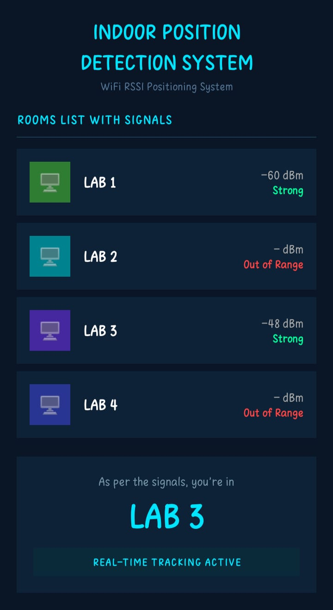
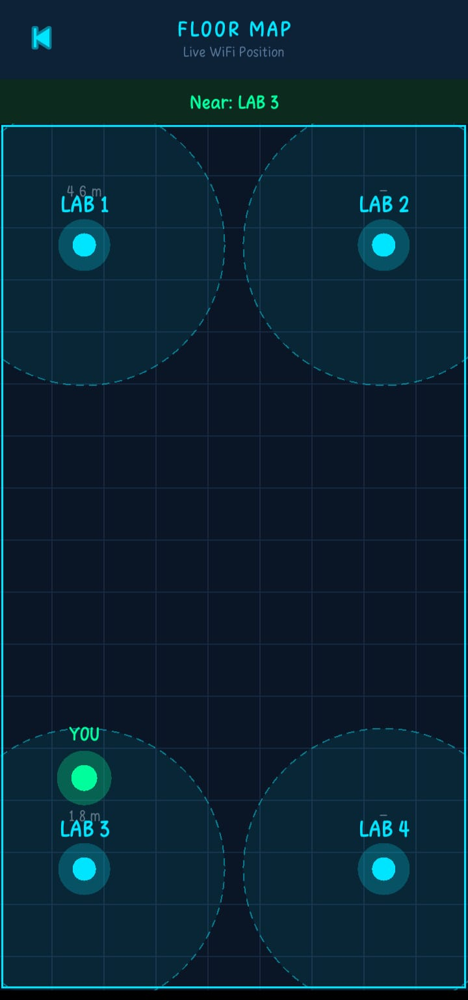
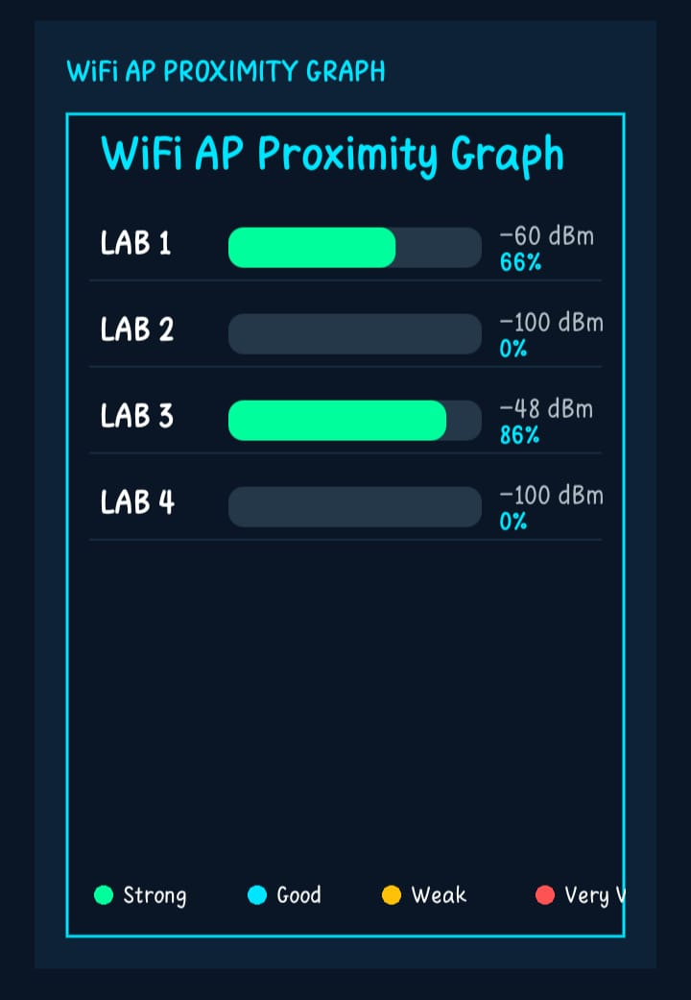
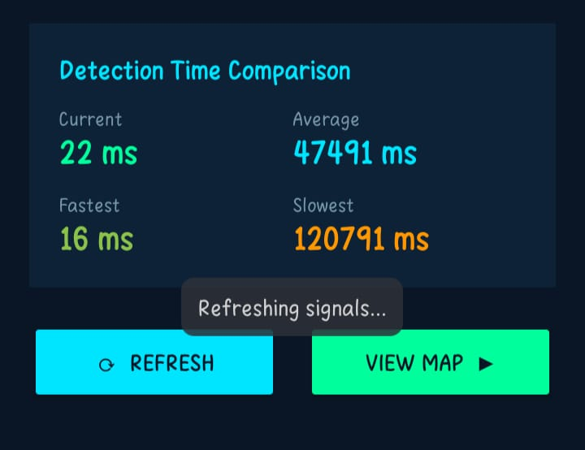

#  Indoor Position Detection System

An Android application that estimates a user's indoor room from WiFi RSSI (Received Signal Strength Indicator) readings from access points mapped to LAB 1–LAB 4. It provides room-level positioning rather than precise coordinates, and shows other signed-in users live on a floor-plan map.

---

##  Screenshots

| Signal Dashboard | Floor Map | Proximity Graph | Detection Time Comparison | 
|:---:|:---:|:---:|:---:|
|  |  |  |  |

> Update `screenshots/2.png` with a screenshot of the new floor-plan map.

---


## How It Works

The app scans nearby WiFi access points and compares each mapped router's RSSI. The strongest signal identifies the detected lab. The floor map estimates a position within that lab using the nearest routers and the distance model below; accuracy is intended to be room-level.

The dashboard and map each refresh WiFi scans every 25 seconds while visible. The dashboard also has a manual refresh control. Detection statistics report the time from a scan request to its results.

## Authentication and Presence

Firebase Authentication with email and password provides Login and Register screens and gates access to the dashboard. Firebase Realtime Database stores scan records under `scans/{pushId}`.

The dashboard's **ACTIVE USERS** list and the map's user markers use `presence/{uid}`. Presence is overwritten on each scan and removed on disconnect or logout. The current user is shown with a green marker (with a white ring, always drawn on top); other active users are pink. Entries older than 90 seconds are treated as stale.

`PresenceRepository` supports multiple subscribers. Each screen registers itself as an owner (`startListening(owner, ...)` / `stopListening(owner)`), so the dashboard and the map can listen at the same time. The underlying Firebase listeners attach when the first subscriber joins and detach when the last one leaves. A screen that subscribes late immediately receives the latest known list.

## Floor Map Behavior

The map draws a square floor-plan image as its background, centered in the view (extra space stays dark). Routers, users, and labels are drawn on top of the image.

- **Routers:** each access point is a small cyan dot at the center of its lab, labeled **LAB 1–LAB 4**, with the live distance in meters drawn below it. No distance is shown for a router that is not detected.
- **Detected-lab highlight:** the room you are detected in gets a soft green highlight.
- **Normal placement:** with two or more detected routers, the dot is placed from the nearest router toward the second nearest.
- **Single-router fallback:** if only one router is detected, the dot is placed near that router, offset toward the map center by the estimated distance.
- **Out of range:** if no router is detected, the user cannot be placed. The caption at the bottom of the map reads **"N on map"**, plus **", M out of range"** when M > 0.
- **Overlap spreading:** users whose positions fall within 60 px of each other are spread on concentric rings around the group's anchor (your own dot, or the group centre). Ring 1 has radius 50 px and each further ring adds 45 px, so 15 or more users in one spot stay visible. Order is deterministic (by name), so dots do not shuffle between updates.
- **Crowd scaling:** with more than 12 users on the map, other users' dots and labels shrink, and long names are shortened.
- **Bounds:** dots and labels stay inside the floor plan, and labels avoid each other.
- **Legend:** a small legend (green = you, pink = others, cyan = router) appears in the top-left corner of the map on wide-enough screens.
- **Scale:** the map is assumed to be 20 m wide, so 1 m of estimated distance equals 1/20 of the map width.

## Floor Map Image

The map background is `app/src/main/res/drawable-nodpi/floor_map.jpeg`.

To use a different image or building:

1. Replace the file, keeping the exact name `floor_map.jpeg` (if the new file is a PNG, delete the old JPEG first; two files with the same resource name break the build).
2. The image must be **square** (ideally under about 2000×2000 px) with four labs laid out as quadrants: LAB 1 top-left, LAB 2 top-right, LAB 3 bottom-left, LAB 4 bottom-right.
3. Run **Build → Clean Project**, then run the app.
4. In `MapView.kt`, retune the image-specific constants if the layout differs:
   - router position fractions (lab centers)
   - lab highlight rectangles
   - the name-cover patch table (rectangles that hide room names printed in the image); set `HIDE_IMAGE_ROOM_NAMES = false` if the new image has no printed names
   - `AP_DRAW_OFFSET_FRACTION` (visual shift of the router marker; 0 draws it at the lab center)
   - `MAP_WIDTH_METERS` (real-world width of the map; default 20)
5. Replace the BSSIDs in `RouterConfig.kt` with your own access points.

## Router Configuration

The BSSID-to-room mapping is defined only in `RouterConfig.kt`, in `routerMap`. The configured access points are:

| Lab | BSSID |
|---|---|
| LAB 1 | `3C:84:6A:B5:DE:24` |
| LAB 2 | `3C:78:95:31:6C:54` |
| LAB 3 | `20:23:51:77:56:E6` |
| LAB 4 | `40:3F:8C:E0:72:36` |

To use this app in another building, replace those BSSIDs with the access point BSSIDs for your four labs. Enter addresses in the usual colon-separated form; the app normalizes scanned BSSIDs to uppercase before lookup.

## Distance Formula

The app uses the **Log-Distance Path Loss** model:

```
distance = 10 ^ ((TxPower - RSSI) / (10 * n))
```

| Variable | Value | Description |
|---|---|---|
| TxPower | -40 dBm | Reference RSSI at 1 meter |
| n | 3.0 | Path loss exponent (indoor) |
| RSSI | measured | Live signal reading in dBm |

When a router is not detected (`RSSI = -100`), the app uses a distance sentinel of `99.0`.

## Setup

1. Clone the repository:

     ```bash
    git clone https://github.com/hrishikeshkanu/indoor-position-detection-system.git
     ```

2. Open the cloned project folder in Android Studio and allow Gradle sync to finish.

3. Set up Firebase:
     - Create a Firebase project and add an Android app with package name `com.example.indoorpositiondetectionsystem`.
     - Download that app's `google-services.json` and place it at `app/google-services.json`. Use your own Firebase configuration when forking; do not replace it with a placeholder.
     - Enable the Email/Password provider in Firebase Authentication.
     - Create a Realtime Database, then open **Realtime Database → Rules**, replace the rules with this JSON, and select **Publish**:

     ```json
     {
         "rules": {
             ".read": false,
             ".write": false,
             "scans": {
                 ".read": "auth != null",
                 "$scanId": {
                     ".write": "auth != null && newData.child('userId').val() == auth.uid"
                 }
             },
             "users": {
                 "$uid": {
                     ".read": "auth != null",
                     ".write": "auth != null && auth.uid == $uid"
                 }
             },
             "presence": {
                 ".read": "auth != null",
                 "$uid": {
                     ".write": "auth != null && auth.uid == $uid",
                     ".validate": "newData.hasChildren(['uid', 'name', 'detectedLab', 'timestamp']) && newData.child('uid').val() == $uid && newData.child('name').isString() && newData.child('detectedLab').isString() && newData.child('timestamp').isNumber()"
                 }
             }
         }
     }
     ```

     > **Important:** Firebase read rules do not cascade upward. The app listens on the whole `presence` node, so `.read` must be set on `presence` itself, not only under `$uid`. Otherwise the listener is rejected with `Permission denied` and every device sees "0 online".

4. Replace the sample router BSSIDs in `RouterConfig.kt` with the real BSSIDs for your four lab access points.

5. Connect an Android device, enable USB debugging, and run the `app` configuration from Android Studio. The minimum supported Android version is API 24.

## Testing With Multiple Devices

1. Install the app on two or more devices and sign in with a different account on each.
2. Open the dashboard on each device. **ACTIVE USERS** should list every signed-in user, and tapping **VIEW MAP** should show them as green (you) and pink (others) markers.
3. To simulate a crowd without many phones, import test entries into `presence` from the Firebase console (Data tab → `presence` → Import JSON) with a far-future `timestamp`. **Delete these test entries afterwards**, because they never go stale.

## Required Permissions

The app declares these permissions:

```xml
<uses-permission android:name="android.permission.ACCESS_FINE_LOCATION" />
<uses-permission android:name="android.permission.ACCESS_COARSE_LOCATION" />
<uses-permission android:name="android.permission.ACCESS_WIFI_STATE" />
<uses-permission android:name="android.permission.CHANGE_WIFI_STATE" />
<uses-permission android:name="android.permission.ACCESS_NETWORK_STATE" />
<uses-permission android:name="android.permission.INTERNET" />
```

Location permission is requested at runtime because Android requires it for WiFi scan results. Firebase Authentication and Realtime Database also require an internet connection.

## Capacity

The app code has no hard limit on the number of users: the dashboard lists, and the map draws, every presence entry newer than 90 seconds. Practical limits come from Firebase:

| Limit | Value (free Spark plan) | Effect |
|---|---|---|
| Simultaneous connections | About 100 | Roughly 100 devices online at once |
| Download quota | 10 GB / month | Bandwidth grows roughly with the square of the user count, since every write is sent to every listener |

As a rough guide at one write per 25 s per user: about 20 users use ~23 MB/hour, 50 users ~145 MB/hour, and 100 users ~575 MB/hour. Check the Firebase console's Usage tab, as plan limits can change. 15+ simultaneous users work comfortably; 30–50 is fine for demos.

## Known Limitations

- Android scan throttling limits `startScan()` to roughly four calls per two minutes per app on Android 9 and newer. The OS controls this limit, and the 25-second interval is slightly above it, so some results may come from the OS cache.
- On Android 10 and newer, the device Location toggle must be ON for WiFi scanning to return results; granting app permission alone may not be enough.
- RSSI fluctuates with walls, furniture, people, and radio interference. The result targets room-level, not precise coordinate, accuracy.
- The path-loss model is approximate, and the map assumes a 20 m width, so the distance of a dot from a router is only a rough guide.
- Overlap spreading moves dots away from their true estimate so that everyone stays visible; spread positions are approximate.
- The floor image is assumed to be square with a four-quadrant layout. Room names printed in the image are covered by small patches, which can be slightly visible; an image without printed names avoids this.
- The `scans` node grows with every scan and has no automatic cleanup.
- Free-plan Firebase limits (connections and bandwidth) apply; see **Capacity**.

## Project Structure

| File | Purpose |
|---|---|
| `LoginActivity.kt`, `RegisterActivity.kt` | Firebase email/password authentication |
| `MainActivity.kt` | Dashboard, scan lifecycle, 25 s auto-refresh, detection statistics, ACTIVE USERS list |
| `MapActivity.kt`, `MapView.kt` | Live map scanning (25 s interval) and Canvas rendering of the floor image, routers, detected-lab highlight, and user markers |
| `RouterConfig.kt` | Single BSSID-to-room mapping and shared distance calculation |
| `PresenceRepository.kt` | Multi-subscriber publish, listen, and stale filtering of live presence |
| `SignalGraphView.kt` | Dashboard RSSI graph |
| `res/drawable-nodpi/floor_map.jpeg` | Square floor-plan image used as the map background |

## Signal Quality Reference

| RSSI Range | Label |
|---|---|
| ≥ -60 dBm | Strong |
| -60 to -70 dBm | Good |
| -70 to -80 dBm | Weak |
| < -80 dBm | Very Weak |
| Not detected | Out of Range |

---

##  Author

**Hrishikesh Kanu**
B.Sc. in Information & Technology
Jahangirnagar University, Bangladesh

---

##  License

This project is built for academic purposes as part of a university project.
